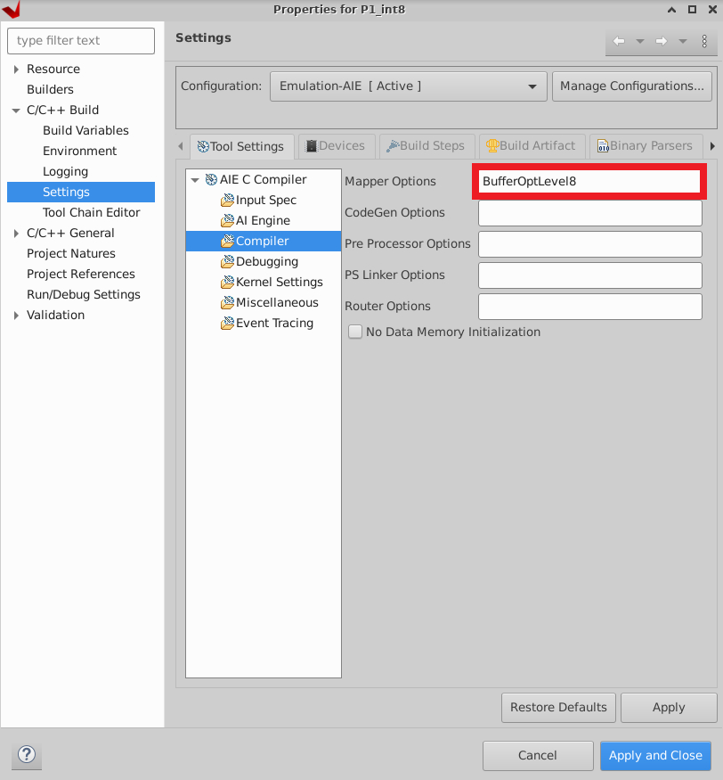

# MaxEVA: Maximizing the Efficiency of Matrix Multiplication on Versal AI Engine

This is the official github repo of MaxEVA paper published at FPT2023 Conference.

Available preprint: **XXXXXXXXXXXXXXXXXXXXXX**

## Requirements

It is recommended to review the [AMD/Xilinx AI Engine blog series](https://support.xilinx.com/s/question/0D52E00006xR6iXSAS/ai-engine-blog-series?language=en_US) before running this tutorial.

This tutorial requires the following:
1. The Vitis 2022.1 software platform installed on a supported Linux OS.
2. A valid license for the AI Engine tools (licenses can be generated from AMD user account).
3. The VCK190 base platform downloaded from the following [link](https://www.xilinx.com/support/download/index.html/content/xilinx/en/downloadNav/embedded-platforms/2022-1.html).

## Create and Compile a MaXEVA Configuration

1. Create a new application project (e.g., named `<project_name_dir>`) as shown [here](https://support.xilinx.com/s/article/1184031?language=en_US).

2. Replace the contents of `<project_name_dir>/data` and `<project_name_dir>/src` directories with a MaxEVA configuration, e.g., [`Pattern1_int8/data`](Pattern1_int8/data) and [`Pattern1_int8/src`](Pattern1_int8/src), respectively for pattern `P1`, `int8` MaxEVA configuration.

3. Right click on `<project_name_dir> [ aiengine ]` and select `C/C++ Build Settings` as shown in the figure below:
   
   

   At `Compiler` Settings > `Mapper Options` invoke buffer optimizations level 8, i.e., `BufferOptLevel8`:

   

   This flag will optimize buffer placement and will prevent buffer conflicts where possible. More details can be found at AMD documentation [UG1076](https://docs.xilinx.com/r/2022.1-English/ug1076-ai-engine-environment/Memory-Stalls).

   
